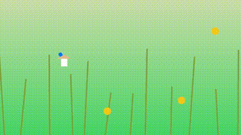

# The Game Development Exquisite Corpse

 

*State of the project on day one versus now (September 4th, after four turns). Naturally, FPS is smoother when it's not in GIF form!*

This is a game design [exquisite corpse](https://en.wikipedia.org/wiki/Exquisite_corpse). You should download this code, add a game mechanic or some other small change or improvement, and submit it. This project uses C and the [Raylib](https://www.raylib.com/) library, but you don't need experience with either to participate!

To participate, check the [request thread](https://github.com/geajack/gdxc/issues/1). If no one has currently claimed the right to play the next "turn", the last comment in that thread will be from me, stating that the next turn is open. In that case, make a comment claiming it. You don't have to wait for approval from anyone to start coding, just submit a pull request. You can participate as many times as you want, but never twice in a row.

## Rules/FAQ

1. As stated above, make sure to declare your intent to submit the next "turn" in the [thread](https://github.com/geajack/gdxc/issues/1).
2. Code must be in pure C and use only the [Raylib](https://www.raylib.com/) library. It should compile with a single clang or gcc command. It should compile and run on Linux, Mac and Windows, but you are not expected to test on all of those yourself.
3. I've been asked this a few times, so to be clear, you are definitely allowed to create other C files besides `main.c`. For now, I prefer one translation unit (i.e. just `#include` everything in `main.c`), but until further notice this is not a hard rule.
4. The game should always be playable with a mouse and keyboard only, to keep it accessible to people that don't have other hardware.
5. Graphics and sound submissions are accepted, but game mechanics and code is preferred. If you do add graphics and sound, make sure to commit any necessary files to this repo.
6. Purely technical submissions like refactors and optimization are discouraged and will probably only be allowed if they fix a significant problem, like the game not compiling on some platforms or something. You can do a little refactoring if it's in aid of an actual mechanic you're adding.
7. There is no hard style guide, but **please use 4 spaces for indentation**. Indentation is a special case because it can affect how convenient it is to navigate the code in an editor. Other than that, we prefer `snake_case` for variables and functions and `CamelCase` for types, but I won't reject a PR for breaking those rules. I also won't reject a PR for modifying the style of existing code, but try not to go too crazy with it (like suddenly reformatting the whole project even though your changes only affect one file).
8. Submit your PR pretty quick, say within 48 hours.
9. Your submission should be an incremental change. Examples: adding a walljump to a platformer, fixing a bug, adding a boss. As a rule of thumb, it should take you between maybe 5 minutes and 3 hours to implement.
10. Bugs or other problems are okay if they're minor and you either didn't notice them or just sincerely could not figure out how to fix them. Just don't submit something obviously completely broken. Slightly janky collision or something is okay.
11. Don't do anything that obviously tramples all over a previous addition. For example, if a recent submission added a powerup, your own submission shouldn't include removing that powerup entirely.
12. You are encouraged to take the game in unexpected directions! Just because the game so far looks like it belongs to one genre, that doesn't mean you can't add a mechanic usually associated with a different genre.
13. You can't play (submit code) two turns in a row.
14. Don't touch this README or the LICENSE.

## Can I participate? I don't know how to use C or Raylib!

**Absolutely!** We are very open to beginners. [Raylib](http://raylib.com/) is an explicitly beginner-friendly library, in fact it was designed by a teacher specifically for a game development course, for people with no coding experience. Programming in Raylib is as simple as checking input with things like `IsKeyPressed()` and drawing the game with things like `DrawRectangle()`. If you need any further help, even with something basic like installing a C compiler, that's what the [discussion forum](https://github.com/geajack/gdxc/discussions) is for.